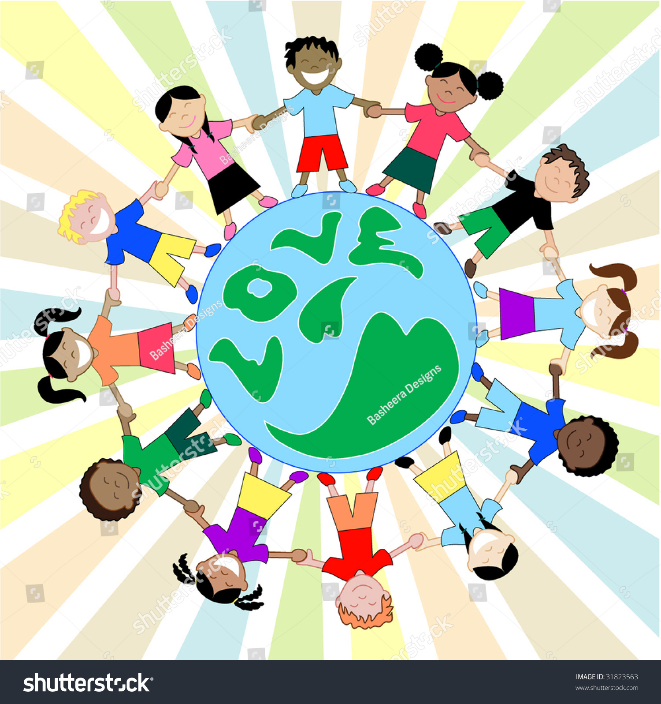

---js
const title = "This is a third post (draft)";
const date = "2023-01-23";
const draft = true;
---

leaveyourlove ep review
find a way to relate every non daft punk thing to daft punk. mention daft punk in every post.

concept lowkey like this: insert image of kids of different nationalities holding hands around the planet

1. intro
2. 

Parcels' music has soundtracked my life from high school onwards. They recently dropped an EP for their single Leaveyourlove, and it may be the most conceptual and cohesive EP I have ever listened to.
